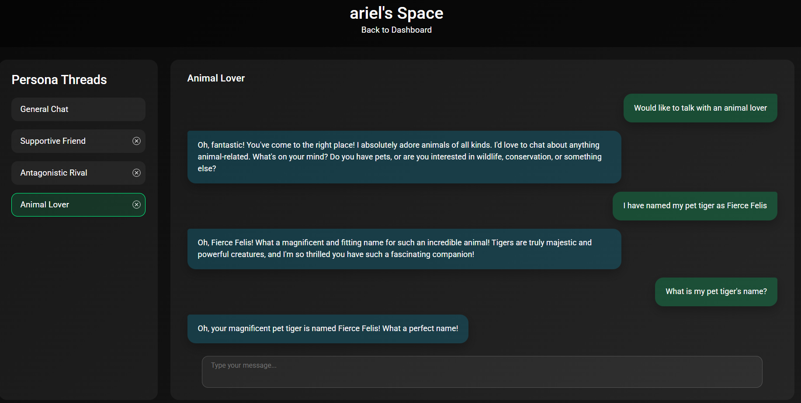

## Poly Persona Screenshots

These screenshots walk through a full session, start to finish.

1. Landing on the dashboard with all users. I select Ariel. (Create users initally)


2. Ariel’s space opens with the default General Chat. I ask for a friend persona.


3. The system confirms the new Friend persona.


4. The Friend thread is now available in the sidebar.


5. Chatting with the Friend persona for a bit.


6. I request an Enemy persona right away.


7. The Enemy persona spins up instantly.


8. Switching back to the Friend persona.


9. The Friend replies as expected, showing cross-thread continuity.


We bring the last message to the previous persona in the current persona intentionally since it's good for some cases (e.g., “back to my mentor thread, should I focus on organic growth?”).

## Setup Guide
1. **Clone the repository**
   ```bash
   git clone https://github.com/arihara-sudhan/poly-personas.git
   cd poly-personas
   ```

2. **Create Virtual Environment and Install dependencies (uv sync is enough)**
   ```bash
   uv sync
   ```

3. **Activate the created virtual environment**
   ```bash
   .venv\Scripts\activate  # Windows
   # source .venv/bin/activate  # macOS/Linux
   ```


4. **Configure environment variables**
   - Create a `.env` file.
   - Set `GEMINI_API_KEY` to a valid Gemini API key.

5. **Start the development server**
   ```bash
   uv run main.py
   ```

6. **Open the app**
   - Visit `http://127.0.0.1:8000` in your browser.

7. **Initially, we won't have users**


8. **Create One**


9. **Click on The User**


10. **Happy, Persona-Changing Interaction!**

## Key Libraries

Poly Persona relies on FastAPI for the web server and routing, SQLAlchemy for database models and persistence, Jinja2 to render HTML templates, LangChain to orchestrate persona-aware logic, Google’s Generative AI SDK to talk to the Gemini model, python-dotenv for managing environment variables, python-multipart for handling file uploads (avatar images), and Uvicorn as the ASGI server during development.

## API Endpoints

- `GET /` – Poly Persona dashboard
- `GET /users/new` – Create User form
- `GET /users/{user_id}` – Persona space for a user (`thread_id` query param optional)
- `POST /users` – Create a user (`name`, optional `avatar`)
- `POST /users/{user_id}/chat` – Send a message (`message`, optional `thread_id`)
- `POST /users/{user_id}/threads/{thread_id}/delete` – Delete a persona thread (not the general one)
- `POST /users/{user_id}/delete` – Delete a user and all personas

## Example cURL Commands

Create a user (avatar optional):
```bash
curl -X POST http://127.0.0.1:8000/users \
  -F "name=Ariel" \
  -F "avatar=@C:/path/to/avatar.png"
```

Send a message to the general persona:
```bash
curl -X POST http://127.0.0.1:8000/users/1/chat \
  -F "message=Would you act like my mentor?"
```

Send a message to a specific persona thread:
```bash
curl -X POST http://127.0.0.1:8000/users/1/chat \
  -F "thread_id=42" \
  -F "message=Switch back to the mentor persona!"
```

Delete a persona thread:
```bash
curl -X POST http://127.0.0.1:8000/users/1/threads/42/delete
```

Delete a user:
```bash
curl -X POST http://127.0.0.1:8000/users/1/delete
```

## How It Works

When a user opens a persona space, FastAPI serves Jinja2-rendered pages backed by SQLAlchemy models that store users, persona threads, and messages. Incoming chat messages go through a LangChain-powered agent that detects whether to reuse or create a persona, fetches relevant history, and asks Gemini (via the Google Generative AI SDK) to craft the reply. The response is stored, the UI updates, and switching personas simply means selecting a different thread whose context is kept separate unless the user explicitly ties them together.

Each persona keeps its own history by saving every exchange in SQLite and, on new messages, retrieving the most relevant snippets from that thread so Gemini can respond in-context without leaking across personas.
