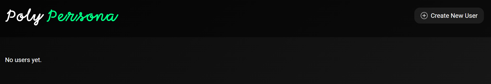
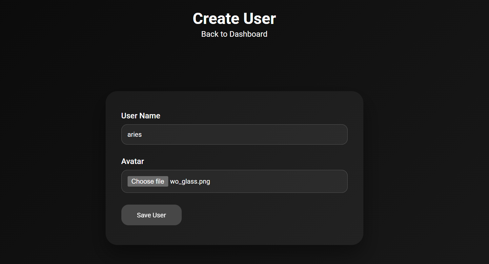
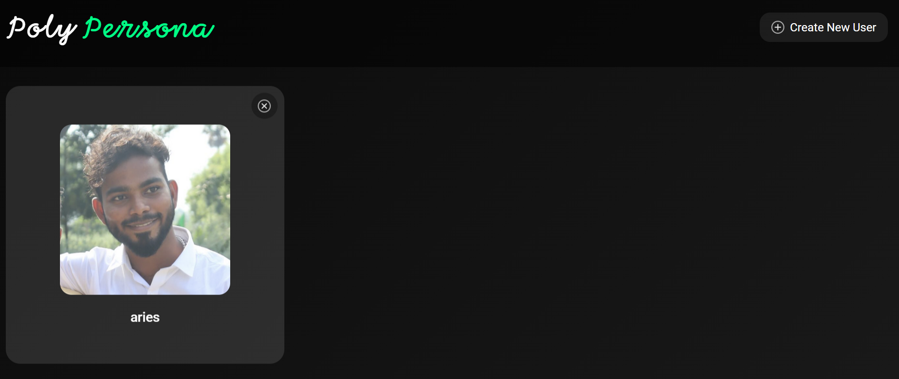

## Poly Persona Screenshots

These screenshots walk through a full session, start to finish.

1. Landing on the dashboard with all users. I select Ariel. (Create users initally)


2. Ariel’s space opens with the default General Chat. I ask for a friend persona.


3. The system confirms the new Friend persona.


4. The Friend thread is now available in the sidebar.


5. Chatting with the Friend persona for a bit.


6. I request an Enemy persona right away.


7. The Enemy persona spins up instantly.


8. Switching back to the Friend persona.


9. The Friend replies as expected, showing cross-thread continuity.


We bring the last message to the previous persona in the current persona intentionally since it's good for some cases (e.g., “back to my mentor thread, should I focus on organic growth?”).

## Setup Guide
1. **Clone the repository**
   ```bash
   git clone https://github.com/arihara-sudhan/poly-personas.git
   cd poly-personas
   ```

2. **Create Virtual Environment and Install dependencies (uv sync is enough)**
   ```bash
   uv sync
   ```

3. **Activate the created virtual environment**
   ```bash
   .venv\Scripts\activate  # Windows
   # source .venv/bin/activate  # macOS/Linux
   ```


4. **Configure environment variables**
   - Create a `.env` file.
   - Set `GEMINI_API_KEY` to a valid Gemini API key.

5. **Start the development server**
   ```bash
   uv run main.py
   ```

6. **Open the app**
   - Visit `http://127.0.0.1:8000` in your browser.

7. **Initially, we won't have users**


8. **Create One**


9. **Click on The User**


10. **Happy, Persona-Changing Interaction!**